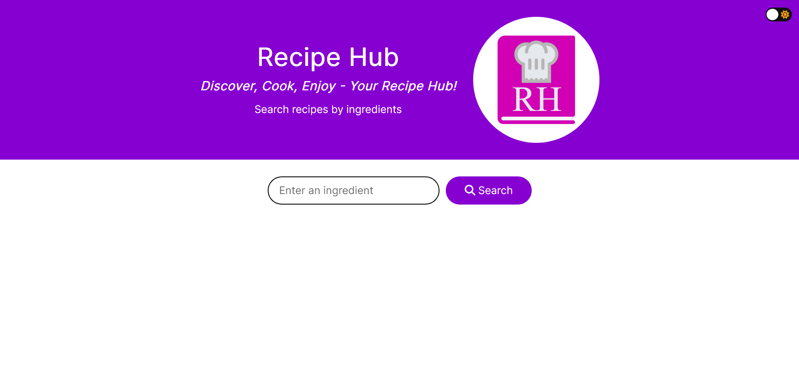

# Chingu Voyage 46 Tier 1 Team 1 - Recipe Hub

## Overview

This is the repository of [Chingu](https://www.chingu.io/) Voyage 46 Tier 1 Team 1 and Recipe Hub, the team's project for the Chingu Voyage. Built in HTML, CSS and vanilla JavaScript, Recipe Hub allows users to search for recipes.

Live Site: [Recipe Hub](https://chingu-voyages.github.io/v46-tier1-team-01/Food-Recipe/)

## Features

This project includes:
- Search bar for searching recipe
- Recipes with information including ingredients, cooking time, region of origin, difficulty, user ratings and nutrition information
- Dark/light mode toggle
- Responsive, mobile-friendly layout
- Accessible web design
- Mobile-first design workflow

## Usage

Input a keyword into the search bar, click the "Search" button or press the Enter key to start searching for recipes. Once the search results are loaded, click the "Get Recipe" button in one of the results for the recipe and its information.

## Running the Project

From the repository:
1. Clone this project locally
1. Open `index.html` using your browser
1. Check out the wen page's functionality

## Dependencies

- [Tasty API](https://rapidapi.com/apidojo/api/tasty)
- Google Fonts: [Inter](https://fonts.google.com/specimen/Inter)
